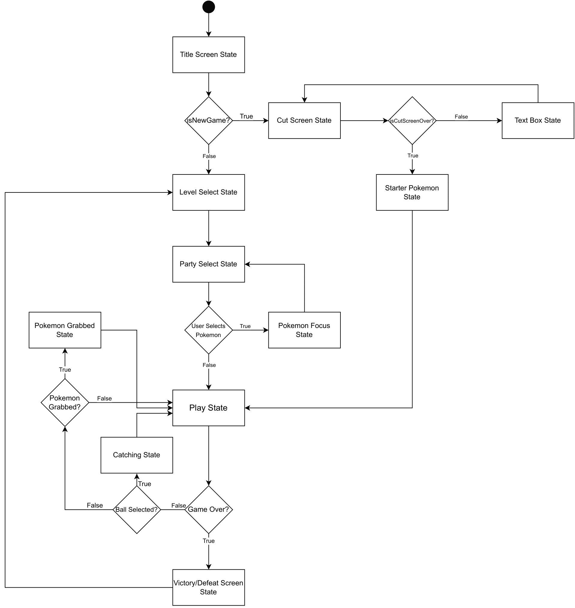
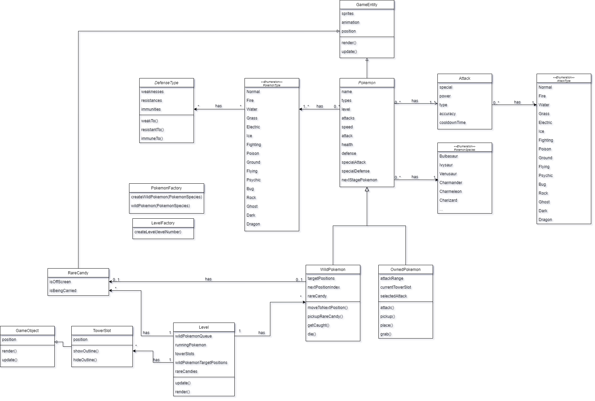
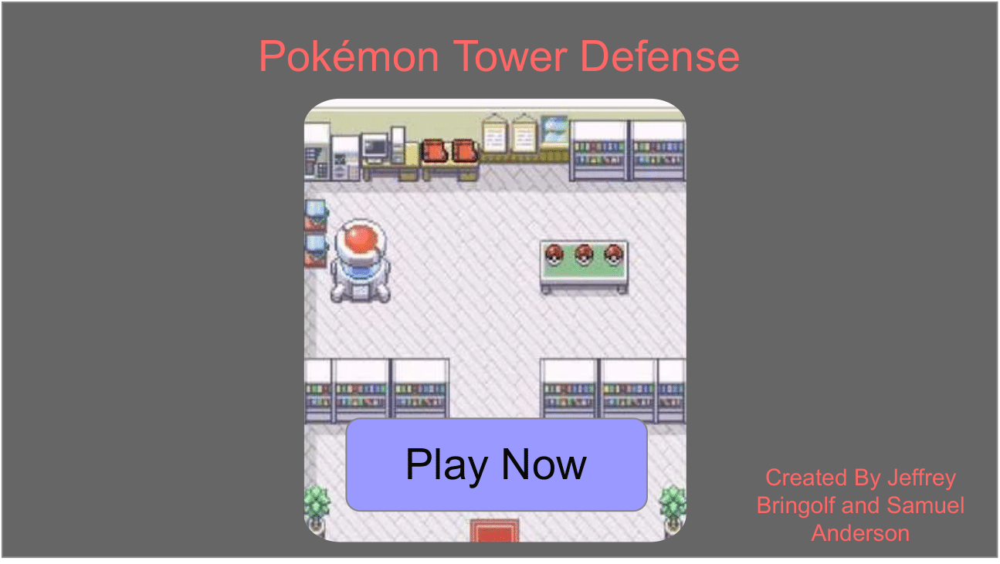
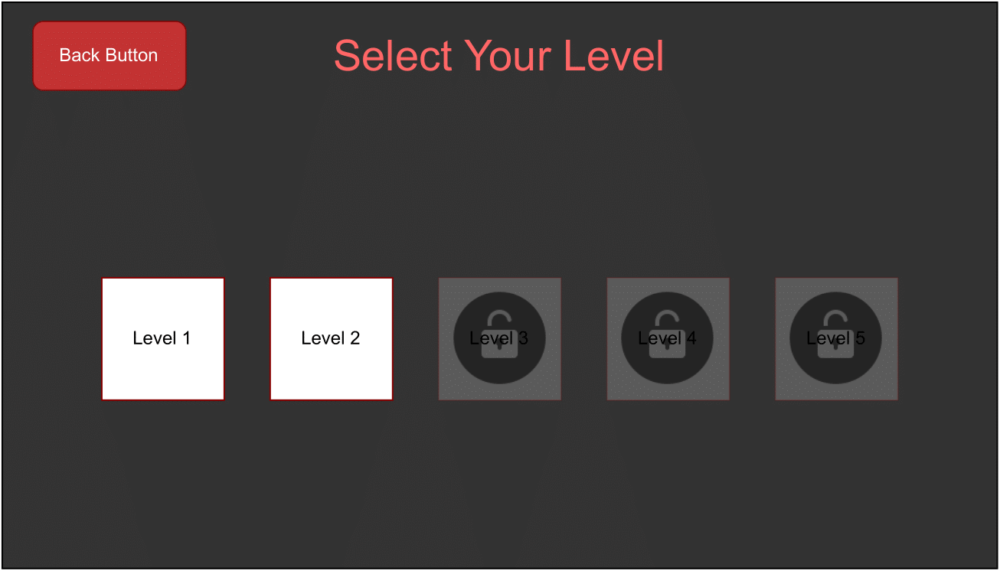
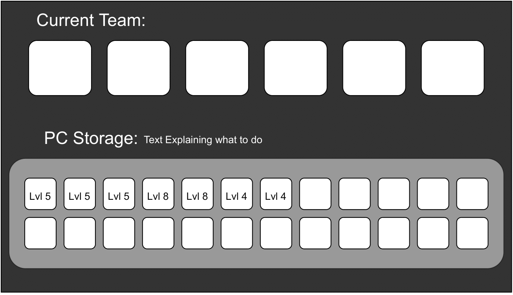
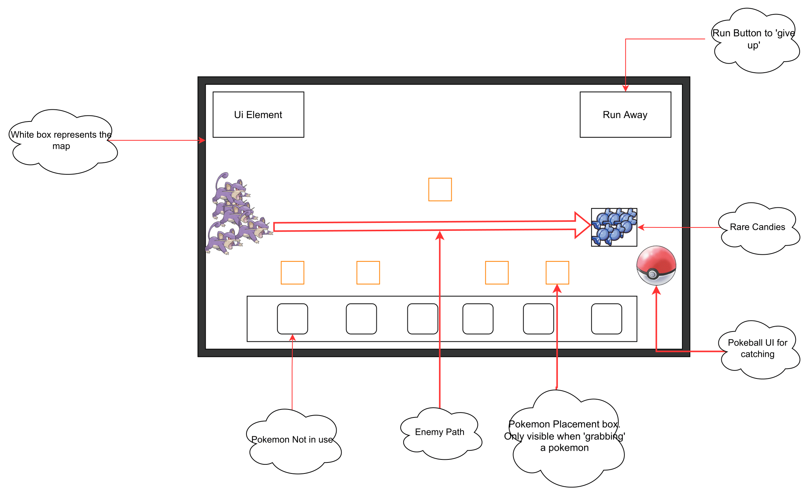

# Game Programming F22 Project - Pokémon Tower Defense

## ✒️ Description
In this tower defense styled game, players will become Pokémon trainers and use their Pokémon to defend cities against enraged and invasive Pokémon species. Players choose their team of up to 6 Pokémon and defend against waves of incoming wild Pokémon. Players are able to place their Pokémon on highlighted squares and can move them as they please. 

Wild Pokémon try to get to the other side of the map and pick up a rare candy. Once they pick a rare candy up they bring it back to their spawn. Should they succeed they come right back and try to get another one. Should they faint on their route, they drop the rare candy and another Pokémon can pick up where the other one left off. 

The player loses the level when all the rare candies are stolen. The player wins the level when all the incoming waves of Pokémon are defeated.

## 🕹️ Gameplay
The game begins with the player picking a name and a starter Pokémon. They are immediately thrusted into the first level where they need to prevent a swarm of Pokémon from stealing professor oak's rare candies. Each wild Pokémon will run from the start to the end of the level, pick up a rare candy, then run back to the beginning of the level and continue. The game loop includes the player placing their Pokémon in set locations (tower locations). These tower locations change depending on the layout of the map. After placing their Pokémon, they are treated as "towers". When a wild Pokémon comes in range of one of your towers, your Pokémon will attack it. You can also select a placed Pokémon to pick from their list of 4 attacks. They will then use the selected attack when wild Pokémon come in range.

Each wild Pokémon's health is indicated by a health bar above their heads. When they get below 20% hp, the health bar turns from green to red and they can be caught. To catch a Pokémon, the player uses the poké ball available in the bottom right of the UI. By clicking and holding on the poké ball, the player starts the catching state. In this state, the game is paused, and the player can hover the poké ball over the Pokémon they want to catch them. When the ball is hovering over a Pokémon with <= 20% hp, and they release the mouse, the Pokémon will be caught. If there is room in the player's party, the Pokémon will be added directly there, otherwise it can be found in the pc.

A level is won when all the wild Pokémon are reduced to 0 hitpoints. Contrarily, the level is lost if all the rare candies are stolen by the Pokémon. At the end of a level, the player is brought to the level select stage. Here, they can view future levels, but can not select them since they are locked. After winning a level, the next one is unlocked. The goal of the game is to make your way through the levels, catching Pokémon as you go.

Finally, your Pokémon can level up and evolve. As they defeat wild Pokémon, they will gain experience. Once they're gained enough experience, the player will be notified that their Pokémon can level up. To level up, the player needs to spend currency (Pokédollars). These Pokédollars are gained by defeating wild Pokémon. If the Pokémon is at a level where levelling up will cause them to evolve, the "level up" indication will instead display "Evolve" and the price to level up will increase.

## 📃 Requirements

1. User can pick a name.
2. Game state can be saved (All Pokémon, player name, and current level)
3. After picking a name, the player is brought to a cutscene in which they pick their starter Pokémon (Charmander, Bulbasaur, or Squirtle).
4. After picking their starter Pokémon, they are immediately placed in level 1.
5. In level 1, a quick tutorial is shown in the form of text boxes explaining how the game works.
6. After the player either wins or loses level 1, they are brought to the level select screen.
7. Player can view all levels, some blacked out before they are reached.
8. Player can click on a level to begin.
9. Player can see all their owned Pokémon before entering a level.
10. Player can place 6 Pokémon into their party to use in a level.
11. Player can place their Pokémon in set positions in a level.
12. Pokémon have a range in which they can attack wild Pokémon.
13. Moving a Pokémon stops the game from progressing.
14. Wild Pokémon move through the level, typically towards rare candies.
15. When a wild Pokémon reaches a rare candy, they pick it up and walk back to the level's entrance, then come back and start again.
16. When all rare candies are stolen, the player loses the level.
17. Wild Pokémon have health bars appearing above them.
18. When a wild Pokémon's health is below 20%, the player can drag a poké ball onto them to capture them.
19. When a wild Pokémon is caught, it is added to the player's party if there is room, otherwise it is added to the player's pc.
20. When a player's Pokémon defeats a wild Pokémon, they gain experience.
21. When a player's Pokémon gets enough experience, they are able to level up by spending money.
22. When a player's Pokémon reaches a certain level, they evolve.
23. When a player's Pokémon defeats a wild Pokémon, they gain money.
24. A player can pick from a list of their Pokémon's attacks, the Pokémon will then use only that attack.
25. When a Pokémon levels up, they will sometimes gain a new attack.
26. After all wild Pokémon are defeated, a win screen is shown, and the player is brought back to the levels page.
27. After a player wins a level, the next level is unlocked.
28. If all the rare candies are stolen, a losing screen is shown, and the player is brought back to the levels page.
29. A player can run from a level by clicking a run button.
30. A player's Pokémon will attack the front-most wild Pokémon.
31. If a wild Pokémon is defeated while holding a rare candy, the rare candy is dropped where it was defeated.
32. If a wild Pokémon is caught while holding a rare candy, the rare candy is dropped where it was defeated.
33. If a wild Pokémon runs into a rare candy in the middle of the route, it picks it up and turns around immediately.
34. Each level begins with a small "cutscene" in which the story is progresses.

### 🤖 State Diagram

#### Game State

#### Pokémon Tower State

### 🗺️ Class Diagram

### 🧵 Wireframes
### Title Screen

We want to have a title screen which will have music to give the player some ambiance before playing the game.
### Level Select Screen

We want the UI of the level select to be as simple as possible. Levels will be clearly indicated if they are playable or not by being greyed out and have a lock image on top of them.
### Party Select

Our 'PC' system will be simple 'drag and drop' for the Pokémon.
### Sample Level

The UI will be as simple and minimal as possible. 

### 🎨 Assets
We used [app.diagrams.net](https://app.diagrams.net/) to create our wireframe diagrams as well as our class diagrams. 
We plan on following the original games mechanics 
which are shared amongst most tower defense style games.

#### 🖼️ Images
The 'topdown' or 'overworld' sprites of the pokemon where taken from [sprite-resource.com](https://www.spriters-resource.com/ds_dsi/pokemonblack2white2/sheet/48050/)

#### ✏️ Fonts
- [Pokemon](https://www.dafont.com/pokemon.font)

#### 🔊 Sounds
Pokemon cries were taken from [Veekun](https://veekun.com/dex/downloads).

Attacking sounds were found on this [Reddit Thread](https://www.reddit.com/r/PokemonROMhacks/comments/9xgl7j/pokemon_sound_effects_collection_over_3200_sfx/).

### Any other sections ... 

### 📚 References
[Pokemon Tower Defense Wiki](https://pokemontowerdefense.fandom.com/wiki/Pokemon_Tower_Defense_Wiki)
